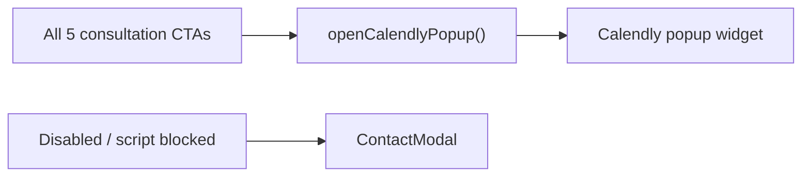

# Calendly Embed Integration Plan — Meridian CPA

**Status:** Implemented — popup-only (Sep 2026)  
**Date:** Sep 2026  
**Scope:** Embed-only Calendly (no Scheduling API). Admins manage event types, invitee questions, and locations in Calendly. All consultation CTAs open the **Calendly popup** — no inline `#book-a-call` section.

**Rollout order:** Validate on **localhost** first (`.env` + restart `npm run dev`), then Vercel env vars + redeploy.

---

## 1. Context from repo inspection

| Area | Current state |
|------|----------------|
| **Framework** | **Vite 7** + **React 18** SPA (`index.html` → `src/index.tsx`) — **client-side only, no SSR** |
| **Routing** | `react-router-dom` v6 in `src/App.tsx` (`/`, `/about`, `/login`, `/dashboard/*`, `/admin/*`) |
| **Styling** | Tailwind CSS 3 + inline brand hex; design tokens: forest `#0F2A1D`, gold `#C9A84C`, cream `#F9F9F6`, body `#2C3E35` |
| **i18n** | `src/lib/translations.ts` — `en` / `zh` via `lang` prop on landing |
| **Env pattern** | `import.meta.env.VITE_*` (see `src/lib/supabase.ts`) |
| **Deploy** | Vercel (canonical URL in `index.html`) |
| **Existing booking** | `#booking` section → `PublicSessionCatalog` → Supabase workshops (`BookingSection.tsx`) |
| **Existing contact** | `ContactModal` — mailto enquiry form; opened by a **single** `openContact` handler in `Desktop.tsx` |
| **Modals** | `ContactModal`, `AdminModal` — good reference for popup accessibility |

### Product placement (recommended)

Calendly should **not replace** the Supabase workshop catalog (`#booking`). It should serve **discovery / advisory calls** (matches FAQ copy: “Book a Consultation”).

| User intent | Surface today | After Calendly |
|-------------|---------------|----------------|
| **Workshop sessions** | `#booking` → `PublicSessionCatalog` → **Supabase** | **Separate from Calendly** — see §4.7 |
| **Consultation call** | Was `ContactModal` | **Calendly popup** — all five CTAs (§4) |
| General enquiry (async) | `#contact` email / phone / WhatsApp | Unchanged — no scheduler required |

---

## 2. Recommended embed approach

### ✅ Use Calendly **popup widget only** (`widget.js` + `widget.css`)

| Option | Verdict | Reasoning |
|--------|---------|-----------|
| **Popup JS embed** | ✅ **Implemented** | All five CTAs call `Calendly.initPopupWidget`; loads `widget.js` + **`widget.css`** on first click |
| Inline `#book-a-call` section | ❌ **Removed** | Not needed — one Calendly event type, no on-page scheduler section |
| Raw iframe | ❌ | Not used |
| Calendly Scheduling API | ❌ Out of scope | Paid API |

### Popup flow — all five CTAs

- `Calendly.initPopupWidget({ url, utm })` on every consultation button click.
- `src/lib/calendly.ts` → `loadCalendlyAssets()` injects **both** stylesheet and script (required for popup to display).
- Preload happens on first CTA click; singleton promise avoids duplicate script tags.

### Script loading (CSR-safe)

1. Do **not** add Calendly to `index.html` globally.
2. Load `widget.css` + `widget.js` dynamically via `loadCalendlyAssets()` in `src/lib/calendly.ts`.
3. After changing `.env`, **restart** `npm run dev` (Vite does not hot-reload env vars).
4. If popup fails, `ContactModal` opens as fallback; check browser console for `[Calendly]` messages in dev.

---

## 3. Branding alignment

### Calendly URL / init params (embed layer)

Append to event URL or pass via `Calendly.initInlineWidget` / `initPopupWidget` **styles** / query string:

| Param | Meridian value | Notes |
|-------|----------------|-------|
| `primary_color` | `0F2A1D` | Forest green — buttons, accents |
| `text_color` | `2C3E35` | Body text tone |
| `background_color` | `F9F9F6` | Cream section background |
| `hide_gdpr_banner` | `1` | Optional — see §8 privacy; only if legal approves |
| `hide_event_type_details` | `0` | Keep duration/location visible (managed in Calendly) |
| `hide_landing_page_details` | `1` | Reduces Calendly marketing chrome inside embed |

Example event URL (placeholder):

```text
https://calendly.com/meridian-cpa/discovery-call?primary_color=0F2A1D&text_color=2C3E35&background_color=F9F9F6
```

### Calendly admin (out of band — no site admin UI)

Configure in **Calendly dashboard**:

- Event type name, duration, location (Zoom / phone / in-person)
- **Invitee questions** (company name, service interest, etc.) — these appear automatically in embed
- Branding → logo, colors (should match params above)
- Availability, buffers, timezone display

### Limitations (document for stakeholders)

- **No custom CSS** inside the iframe — only Calendly params + Calendly account branding.
- Font will be Calendly’s, not Geist/serif from the site.
- Widget chrome (step indicator, powered-by) may still appear on free tiers.
- Mobile layout is Calendly-controlled; we only control outer section padding/max-width.

### Our wrapper styling (full control)

- Section header: serif title, gold rule — match `BookingSection` / `ContactSection`.
- Outer container: `max-w-[1180px]`, cream background, `scroll-mt-24` for fixed header.
- Loading skeleton: cream/gold pulse matching site (not white box flash).

---

## 4. CTA wiring — “Contact us” & “Book Now” → Calendly

**Product decision (locked):** All **five** consultation CTAs open the **Calendly popup**. No `#book-a-call` inline section. `ContactModal` is fallback only.

### 4.2 CTA labels & behavior (locked — Sep 2026)

All consultation CTAs use **“Book a call”** (EN) / **“預約通話”** (buttons) or **“預約諮詢”** (header nav) and open the **Calendly popup**.

| # | Location | Label (EN) | Action | `utm_content` |
|---|----------|------------|--------|---------------|
| 1 | Hero | Book a call | Calendly popup | `hero-book-now` |
| 2 | Header nav | Book a call | Calendly popup | `header-contact` |
| 3 | Services section | Book a call | Calendly popup | `services-cta` |
| 4 | Booking advisory banner | Book a call | Calendly popup | `booking-banner` |
| 5 | Get in touch section | Book a call | Calendly popup | `contact-section` |

**Async contact (no modal):** `#contact` section provides **WhatsApp**, **mailto email**, and **phone**. `ContactModal` (enquiry form) is **fallback only** when Calendly fails.

Shared copy key: `translations.cta.bookACall` — used by hero, services, contact, and booking banner buttons.



### 4.3 Handler architecture (`Desktop.tsx`)

```tsx
const { openCalendlyPopup } = useCalendlyBooking({ onFallback: openContactFallback });

<HeroSection onBookNowClick={() => openCalendlyPopup("hero-book-now")} />
<TopNavigationSection onContactClick={() => openCalendlyPopup("header-contact")} />
// ... services, booking banner, contact section — same pattern
```

### 4.7 “Book a Session” vs Calendly (important)

These are **two different systems**:

| Section | What it is | Data source |
|---------|------------|-------------|
| **Book a Session** (`#booking`) | Workshop / info session catalog | **Supabase** `sessions` table |
| **Consultation CTAs** | Discovery call scheduling | **Calendly** popup |

**“Failed to load sessions”** comes from `PublicSessionCatalog` → `fetchPublicSessions()` (Supabase), **not** Calendly. Common causes:

1. **Missing env on deploy** — `VITE_SUPABASE_URL` / `VITE_SUPABASE_ANON_KEY` not set in Vercel Preview
2. **`app_settings` migration** not applied on remote Supabase
3. **Dev server not restarted** after `.env` changes
4. Previously: logged-in user booking fetch failed and masked session load (fixed — errors decoupled)

Calendly popup failing silently used to open `ContactModal` (mailto form) — check dev console for `[Calendly] Popup failed`.

### 4.4 `ContactModal` fate

**Demote to fallback** when `VITE_CALENDLY_ENABLED=false`, script timeout, or adblock. Remove from happy path when Calendly is on. `#contact` email/WhatsApp remain for async enquiries.

### 4.5 Copy & labels (locked)

| Element | EN | ZH | Notes |
|---------|-----|-----|-------|
| Header nav CTA | Book a call | 預約諮詢 | `nav.bookACall` |
| All other Calendly buttons | Book a call | 預約通話 | `cta.bookACall` |
| Get in touch — async | WhatsApp / email / phone | Same | No enquiry modal on happy path |
| Enquiry modal | Send an enquiry | 發送查詢 | Fallback only |

FAQ and booking banner copy updated to reference “Book a call” and direct async enquiries to `#contact`.

### 4.6 Localhost setup (do this before Vercel)

1. Add to `.env` (project root):
   ```env
   VITE_CALENDLY_URL=https://calendly.com/your-org/your-event
   VITE_BRAND_PRIMARY=0F2A1D
   VITE_BRAND_BG=F9F9F6
   ```
2. **Stop and restart** `npm run dev`.
3. Click **Book a call** (hero, header, or contact section) — Calendly modal should appear.
4. If mailto `ContactModal` opens instead → check console for `[Calendly]` errors (missing env, adblock, or script blocked).

**Do not** remove `#booking` or Supabase workshop flows.

---

## 5. Data capture & prefill

### Invitee questions (Calendly-side)

- Configure in Calendly → Event type → **Invitee questions**.
- No code required; answers appear in Calendly notifications and calendar invite.
- Plan QA step: submit test booking and verify questions + location in Calendly admin.

### Optional prefill (future-friendly, not required v1)

Calendly supports:

```ts
prefill: {
  name: string;
  email: string;
  customAnswers?: { a1: string; ... };
}
```

**v1:** No on-site pre-step form.  
**v2:** If user is logged in (`useAuth`), pass `profile.first_name` + `profile.last_name` + `profile.email` into embed init.  
**v2:** Small optional form above embed (name/email) → re-init widget with prefill on submit.

Store prefill wiring in `src/lib/calendly.ts` as optional params; default empty object.

---

## 6. Reliability & performance

| Concern | Mitigation |
|---------|------------|
| **CLS** | Reserve `min-h-[700px]` (desktop) / `min-h-[620px]` (mobile); skeleton until iframe loads |
| **Lighthouse** | Lazy-load script when `#book-a-call` is near viewport (`IntersectionObserver` with `rootMargin: 200px`) **or** on first CTA click for popup-only pages |
| **Duplicate script** | Singleton promise in `loadCalendlyScript()` — resolve once `window.Calendly` exists |
| **Route changes** | On unmount: clear inline parent `innerHTML`; avoid double `initInlineWidget` |
| **SPA navigation** | If using `/book-a-call` route, mount embed in `useEffect` keyed on `location.pathname` |
| **Failed load** | Show fallback UI: “Scheduler unavailable” + mailto / WhatsApp / `ContactModal` button |
| **Adblockers** | Some block `calendly.com`; detect script `onerror` / timeout → fallback |

**No SSR implications** — Vite SPA only renders embed after hydration.

---

## 7. Security & privacy

| Topic | Notes |
|-------|-------|
| **Data passed from our site** | v1: only public event URL + color params. v2 prefill: name/email from profile or form (user-consented). |
| **Data stored** | Booking data lives in **Calendly** (and invitee’s calendar). Not in Supabase unless you add webhooks later. |
| **Third-party iframe** | Content served from `calendly.com`; subject to Calendly privacy policy. |
| **Cookies** | Calendly may set analytics/session cookies inside iframe; may interact with site cookie banners. Document in privacy policy. |
| **GDPR banner** | Calendly shows its own GDPR notice unless `hide_gdpr_banner=1` — **get legal sign-off** before hiding. |
| **CSP** (if added later) | Allow `frame-src https://calendly.com`; `script-src https://assets.calendly.com` |
| **Secrets** | Event URL is **not secret** (public scheduling link). No API keys for embed-only. |

---

## 8. Environment & configuration

### Vercel env vars (`VITE_*` — exposed to client, expected for embed URL)

| Variable | Required | Example | Purpose |
|----------|----------|---------|---------|
| `VITE_CALENDLY_EVENT_URL` | Yes | `https://calendly.com/your-org/discovery-call` | Base event link (no query string required if using init styles) |
| `VITE_CALENDLY_PRIMARY_COLOR` | No | `0F2A1D` | Default forest green |
| `VITE_CALENDLY_TEXT_COLOR` | No | `2C3E35` | Body text |
| `VITE_CALENDLY_BACKGROUND_COLOR` | No | `F9F9F6` | Cream |
| `VITE_CALENDLY_HIDE_GDPR_BANNER` | No | `false` | String boolean — default show banner |
| `VITE_CALENDLY_ENABLED` | No | `true` | Feature flag — `false` hides section + shows fallback |

### Central config module

**Add:** `src/lib/calendly.ts`

- `getCalendlyConfig()` — reads env, builds URL with query params
- `loadCalendlyScript(): Promise<void>`
- `initCalendlyInline(parent: HTMLElement, options?)`
- `openCalendlyPopup(utmContent?: string)` — per-CTA UTM tagging
- Type augmentation for `window.Calendly` (minimal)

### Local dev

- `.env.local` (gitignored) — copy from `.env.example`
- Document in README / Implementation folder only (no secrets in repo)

---

## 9. Files to add or modify

### New files

| Path | Purpose |
|------|---------|
| `src/lib/calendly.ts` | Config, script loader, init helpers, feature flag |
| `src/components/CalendlyInlineEmbed.tsx` | Inline widget + skeleton + error fallback |
| `src/hooks/useCalendlyBooking.ts` | `scrollToBookACall`, `openCalendlyPopup(utmContent)`, fallback detection |
| `src/screens/Desktop/sections/BookACallSection/BookACallSection.tsx` | Section wrapper (title, cream bg, embed) |
| `src/screens/BookACall/BookACallPage.tsx` | *(Optional)* standalone `/book-a-call` page |
| `.env.example` | Document `VITE_CALENDLY_*` vars |
| `Implementation/CALENDLY_INTEGRATION_PLAN.md` | This document |

### Modify

| Path | Change |
|------|--------|
| `src/screens/Desktop/Desktop.tsx` | Replace `openContact` with Calendly handlers; `ContactModal` only as fallback |
| `src/screens/Desktop/sections/HeroSection/HeroSection.tsx` | `onBookNowClick` → scroll to `#book-a-call` (no prop rename needed) |
| `src/screens/Desktop/sections/TopNavigationSection/TopNavigationSection.tsx` | `onContactClick` → Calendly popup; optional nav link `#book-a-call` |
| `src/screens/Desktop/sections/MainContentSection/MainContentSection.tsx` | Insert `<BookACallSection />` after services; pass popup handler with `utm_content` |
| `src/screens/Desktop/sections/ContactSection/ContactSection.tsx` | `onBookClick` → Calendly popup (via parent) |
| `src/screens/Desktop/sections/BookingSection/BookingSection.tsx` | Pass through popup handler to `PublicSessionCatalog` |
| `src/lib/translations.ts` | `bookACall.*`, nav label, FAQ copy tweak |
| `src/App.tsx` | *(Optional)* route `/book-a-call` → `BookACallPage` |
| `Implementation/IMPLEMENTATION_LANDING_PAGE_BOOK.md` | CTA table: hero scroll vs header popup vs workshops |
| `Implementation/IMPLEMENTATION_ROADMAP.md` | Calendly as post-prototype enhancement *(optional)* |

### Do **not** modify

- Admin screens (`/admin/*`) — no on-site Calendly admin
- Supabase booking libs — workshop flow stays separate
- `ContactModal.tsx` — keep file; remove from default path only

---

## 10. Step-by-step task list

### Phase A — Calendly account setup (non-code)

- [ ] A1. Create / confirm Calendly org account
- [ ] A2. Create **one** event type (e.g. “Discovery call — 30 min”)
- [ ] A3. Set location (Zoom / Google Meet / phone / in-person)
- [ ] A4. Configure **invitee questions** (company, service line, notes)
- [ ] A5. Set availability, timezone (**Asia/Hong_Kong**), buffers
- [ ] A6. Calendly branding: upload logo, align colors with `#0F2A1D` / `#C9A84C`
- [ ] A7. Copy **event scheduling URL** for env var
- [ ] A8. Send test invite to team inbox; verify questions + location in email

### Phase B — Config & loader

- [ ] B1. Add `.env.example` with `VITE_CALENDLY_*`
- [ ] B2. Set vars in Vercel Preview + Production
- [ ] B3. Implement `src/lib/calendly.ts` (config + script singleton + types)
- [ ] B4. Unit-test config builder (URL params, disabled flag) if test harness exists; else manual

### Phase C — Inline embed (primary)

- [ ] C1. Build `CalendlyInlineEmbed.tsx` (skeleton, min-height, error state)
- [ ] C2. Lazy-load script (viewport or mount — pick one, document choice)
- [ ] C3. Build `BookACallSection.tsx` (header + embed, `id="book-a-call"`)
- [ ] C4. Insert section in `MainContentSection.tsx`
- [ ] C5. Add translations EN/ZH
- [ ] C6. Add nav anchor in `TopNavigationSection.tsx`

### Phase D — CTA wiring (all five — required)

- [ ] D1. Implement `useCalendlyBooking` hook (`scrollToBookACall`, `openCalendlyPopup`)
- [ ] D2. Wire CTA #1: `HeroSection` → scroll to `#book-a-call`
- [ ] D3. Wire CTA #2: `TopNavigationSection` “Contact us” (desktop + mobile) → popup (`header-contact`)
- [ ] D4. Wire CTA #3: services button in `MainContentSection` → popup (`services-cta`)
- [ ] D5. Wire CTA #4: advisory banner in `PublicSessionCatalog` → popup (`booking-banner`)
- [ ] D6. Wire CTA #5: `ContactSection` `onBookClick` → popup (`contact-section`)
- [ ] D7. Fallback: when Calendly disabled/fails, restore `ContactModal` or mailto/WhatsApp
- [ ] D8. QA all five entry points + popup on mobile Safari (scroll lock, address bar)

### Phase D2 — Standalone route (optional)

- [ ] D2.1. Add `/book-a-call` route + minimal layout (header/footer or embed-only)
- [ ] D2.2. Link from FAQ answer / footer

### Phase E — Polish & docs

- [ ] E1. Fallback when `VITE_CALENDLY_ENABLED=false` or script fails
- [ ] E2. Update `IMPLEMENTATION_LANDING_PAGE_BOOK.md` CTA table
- [ ] E3. Privacy policy note (third-party scheduler, Calendly link)

### Phase F — QA & rollout (see §11–12)

---

## 11. QA checklist

### Functional

- [ ] Inline embed loads on homepage `#book-a-call`
- [ ] Complete booking end-to-end → appears in Calendly admin + calendar email
- [ ] Invitee questions configured in Calendly appear in embed flow
- [ ] Location (Zoom/etc.) shown correctly in confirmation
- [ ] Timezone: book as HK user; verify displayed times sensible
- [ ] Timezone: book with browser set to US/EU; verify invitee picks correct local time
- [ ] All **five** consultation CTAs reach Calendly (hero scroll + four popups)
- [ ] Each popup source books successfully with correct `utm_content` in Calendly reporting (if UTM enabled)
- [ ] `VITE_CALENDLY_ENABLED=false` hides embed, shows fallback
- [ ] Broken URL shows fallback, not infinite spinner

### Cross-browser / device

- [ ] Chrome desktop
- [ ] Safari desktop (macOS)
- [ ] Safari iOS (iPhone)
- [ ] Chrome Android
- [ ] Narrow viewport 320px width

### Performance

- [ ] No Calendly script on `/login`, `/admin/*` (if lazy-scoped correctly)
- [ ] Lighthouse on `/` — note TBT impact; script should not block first paint of hero
- [ ] No large layout shift when embed appears (CLS < 0.1 on section)

### Privacy / compliance

- [ ] GDPR banner visible by default (unless legal approved `hide_gdpr_banner`)
- [ ] Site cookie banner (if any) documented alongside Calendly cookies
- [ ] Privacy policy mentions Calendly as processor

### Adblock / network

- [ ] uBlock / Brave shields — fallback message appears
- [ ] Slow 3G throttle — skeleton shows, then embed or timeout fallback

### Regression

- [ ] `#booking` workshop catalog still works
- [ ] `ContactModal` fallback works when `VITE_CALENDLY_ENABLED=false`
- [ ] `#contact` email / phone / WhatsApp unchanged
- [ ] EN/ZH language toggle doesn’t break section (titles translate; widget may stay EN)
- [ ] Navigate away from `/book-a-call` and back — embed re-inits cleanly

---

## 12. Rollout plan

| Stage | Action |
|-------|--------|
| **1. Feature flag off** | Merge code with `VITE_CALENDLY_ENABLED=false` in production |
| **2. Preview deploy** | Vercel preview URL + real Calendly event (test mode or hidden event) |
| **3. Internal QA** | Team books test slots; verify emails + questions |
| **4. Enable prod** | `VITE_CALENDLY_ENABLED=true` on production |
| **5. Soft launch** | Nav link live; monitor Calendly dashboard for real bookings |
| **6. Fallback** | If Calendly outage: set flag false or swap CTA to `ContactModal` / WhatsApp |

**Rollback:** Toggle env flag — no DB migration, no Supabase coupling.

---

## 13. Future upgrades (post-embed)

| Upgrade | Requires | Notes |
|---------|----------|-------|
| **Prefill** from logged-in `profile` | Embed only | `useAuth` → pass name/email to init |
| **On-site mini-form** before embed | Embed only | Collect name/email → prefill |
| **UTM tracking** | Embed `utm` params | `utm_source=meridian-site&utm_medium=book-a-call` |
| **Multiple event types** | Multiple URLs or Calendly routing forms | e.g. audit vs tax discovery — still embed, pick URL per CTA |
| **Calendly webhooks** | Paid plan + Edge Function | Sync bookings to Supabase / CRM |
| **Scheduling API** | Paid Calendly | Programmatic slot display — explicitly out of scope now |
| **ZH event type** | Second Calendly event | Switch URL when `lang === 'zh'` |
| **Google Analytics events** | `onEventScheduled` callback if using Calendly JS events | Track conversion |

---

## 14. Open product decisions (remaining)

| # | Decision | Status |
|---|----------|--------|
| 1 | All five CTAs → Calendly popup | ✅ **Locked** |
| 2 | CTA label “Book a call” (header + buttons) | ✅ **Locked** |
| 3 | No inline `#book-a-call` section | ✅ **Locked** — popup only |
| 4 | Enquiry modal | ✅ **Fallback only**; async via `#contact` email/WhatsApp |
| 5 | GDPR banner | Show (recommended) or hide with legal approval |
| 6 | Single vs dual Calendly events | One URL for all consults vs separate audit/tax types |

---

## 15. Effort estimate

| Phase | Estimate |
|-------|----------|
| Calendly admin setup | 1–2 hours |
| Config + loader + inline embed | 4–6 hours |
| Section + nav + i18n | 2–3 hours |
| Popup + CTA wiring (all five) | 2–3 hours |
| `/book-a-call` route (optional) | 1–2 hours |
| QA + Vercel env | 2–3 hours |
| **Total (inline + CTAs)** | **~2–3 days** |
| **Total (with `/book-a-call` route)** | **~3 days** |

---

## 16. References

- [Calendly embed overview](https://help.calendly.com/hc/en-us/articles/223147027-Embed-options-overview)
- [Inline embed](https://help.calendly.com/hc/en-us/articles/223147027-Embed-options-overview#inline-embed)
- [Popup widget](https://help.calendly.com/hc/en-us/articles/223147027-Embed-options-overview#popup-embed)
- [Advanced embed parameters](https://help.calendly.com/hc/en-us/articles/223147027-Embed-options-overview) (colors, hide_gdpr_banner)
- Internal: `Implementation/IMPLEMENTATION_LANDING_PAGE_BOOK.md` (CTA hierarchy)
- Internal: `Implementation/IMPLEMENTATION_ROADMAP.md` (prototype complete; Calendly is additive)
